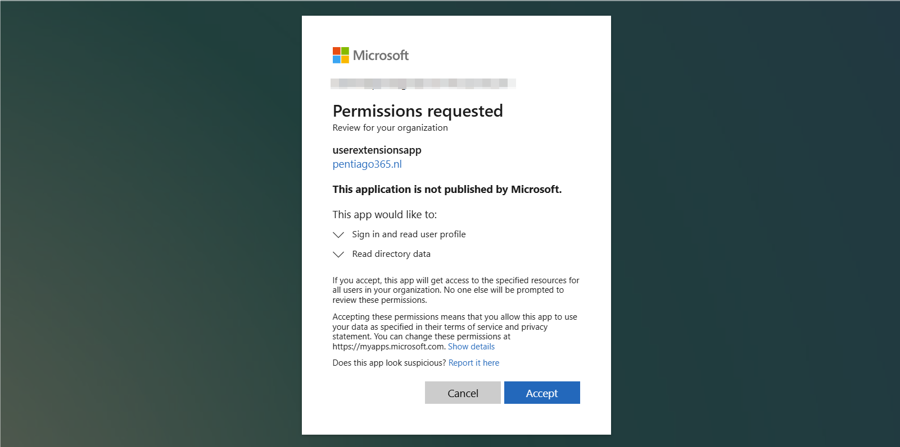

<!-- # Managing Inbound Provisioning for Employees with Multiple Employments in Microsoft Entra -->

**I've done my fair share of Inbound Provisioning implementations in Microsoft Entra. Employees with multiple contracts at the same company are common and tricky for inbound provisioning. The real headache appears when you try to automate birthright access with Entitlement Management: attributes like `jobTitle` and `department` only accept a single value. The good news? With a few smart patterns in Microsoft Entra, you can handle these multi-employment scenarios cleanly, keep HR data aligned, and provision access accurately at scale. This post shows you how.**

Multiple contracts? Yes, it is more common than you think. Each HR(M)-system works differently and each company as well. I've seen organizations that create a custom position in their hr-system for each employee that joins an extra department. But in The Netherlands, it is common to have contracts for 2 days a week for role X at department Y, and another contract for 3 days a week for role Z at a different department. I've seen HR(M)-systems output `person`-cards with just primary employment information, but also API's that output every single `employment` but with the same user-information.

In most cases organizations are happy with provisioning of the primary employment information or the information for the role in which the employee works the most hours. With grouping on user-information in your system or code of choice, and selecting the objects that fit your policies, you're probably fine. However, I recently had the requirement to assign Birthright access automatically based on attributes. Also for those users with double-employments. For all their roles.

So, what can we do to let this work? This post goes in to detail on how to do automated entitlement management with double employments. Next time I will cover on setting up the provisioning of multi-valued custom attributes.

> **Birthright Access** is the automatic provision of the minimum necessary access rights to employees based on their job title, department or other attributes. You get access because you exist and belong to a certain department or you have a certain job.
{: .prompt-info }

## Types of custom attributes in Entra

There are five ways of storing data in fields that don't natively exist in Microsoft Entra:

1. **Custom Security Attributes**: Meant for PII data that is needed in target applications. Has no multi-value type. Not available in Dynamic Queries.
1. **Extension attributes (1-15)**: Originally meant to sync on-premises extension attributes to Entra. Only single valued strings. Can't be managed from Entra directly for hybrid accounts. These are available in Dynamic Queries.
1. **Directory extensions**: You add extensions to an `application` that then can be used to store custom data. Supports multi-valued-strings :)
1. **Schema extensions**: Configured on the tenant and can be assigned to almost all resource types. Even to Administrative Units. Not available in Dynamic Queries.
1. **Open extensions** Not discoverable or filterable data. Meant for SharePoint or Exchange related content. Not available in Dynamic Queries.
More differences can be found [here](https://learn.microsoft.com/en-us/graph/extensibility-overview?tabs=http#comparison-of-extension-types).

To have a solution for entitlement management with multi-employments, we need the attribute to be multi-valued and to be available in Dynamic Queries. This means we are bound to Directory extensions to achieve our goal.

## How to create directory extensions

Before you can store user attribute data in a directory extension, you have to do three things:

1. Choose an existing, or register an, application on which you will create the directory extension
1. Define and create the directory extension
1. Consent to app permissions to be able to use the extension attribute for users

### Register an application to store the user data 

Some text about app registration and a post action to the `/extensionProperties` endpoint with the right body. Give an example for `departmentJobtitle` field.
Note that the app registration needs user.readwrite.all permissions! :S:S:S and Check if it is also possible with less. Maybe check the permissions of the b2c extensions app in LABS.

Do a HTTP `POST` to `https://graph.microsoft.com/v1.0/applications` with the `Content-Type application/json` header and the following body to register an application with the name `userextensionsapp` and Graph App Permissions to `User.ReadWrite.All`.

```json
{
    "displayName":"userextensionsapp",
    "requiredResourceAccess": [
        {
            "resourceAppId": "00000003-0000-0000-c000-000000000000",
            "resourceAccess": [
                {
                    "id": "741f803b-c850-494e-b5df-cde7c675a1ca",
                    "type": "Role"
                }
            ]
        }
    ]
}
```

This will result in a response that contains the name of the attribute that can be used on users:

>Note: The response object shown here is shortened for readability.
{: .prompt-warning}

```json
HTTP/1.1 200 OK
Content-type: application/json

{
    "@odata.context": "https://graph.microsoft.com/v1.0/$metadata#applications/$entity",
    "id": "cc9f54ff-2c2d-4bc8-864d-825b914bb925",
    "appId": "481a96bd-d57c-4129-9a79-8138fbd51076",
    "createdDateTime": "2025-11-29T19:09:12.9375905Z",
    "displayName": "userextensionsapp",
    "description": null,
    "signInAudience": "AzureADMyOrg",
    "keyCredentials": [],
    "passwordCredentials": [],
    "requiredResourceAccess": [
        {
            "resourceAppId": "00000003-0000-0000-c000-000000000000", // Microsoft Graph
            "resourceAccess": [
                {
                    "id": "741f803b-c850-494e-b5df-cde7c675a1ca", // User.ReadWrite.All
                    "type": "Role"
                }
            ]
        }
    ],
}
```

### Define the directory extension object

The next step is to add the extension property by posting to property to the `/extensionProperties` endpoint of the registered application. Therefore we need the `id` from the last response. The following `POST` needs to be made to `https://graph.microsoft.com/v1.0/applications/<id-from-the-last-response>/extensionProperties`

```json
{
    "name": "departmentJobTitle",
    "dataType": "String",
    "isMultiValued": true,
    "targetObjects": [
        "User"
    ]
}
```

The response should look like this:

```json
{
    "@odata.context": "https://graph.microsoft.com/v1.0/$metadata#applications('cc9f54ff-2c2d-4bc8-864d-825b914bb925')/extensionProperties/$entity",
    "id": "62922177-4d95-4f82-af0c-9944e6ede45b",
    "deletedDateTime": null,
    "appDisplayName": "userextensionsapp",
    "dataType": "String",
    "isMultiValued": true,
    "isSyncedFromOnPremises": false,
    "name": "extension_481a96bdd57c41299a798138fbd51076_departmentJobTitle",
    "targetObjects": [
        "User"
    ]
}
```
As you can see, a multi-valued extension property called `departmentJobTitle` has been created on the app with the name `userextensionsapp`. The `name` of the new extension follows this convention: `extension_` `appId of the newly registered app without hypens` `_<the name we used in the POST>`.

### Consent to the app

Now there is a strange step that I need to verify if my findings are right: The app needs to have gotten consent to some sort of Graph API permission, but it doesn't need to keep the permissions. I've checked the native b2c-extensions-app in a b2c tenant and that has non-consented permissions for Directory.Read.All and Directory.ReadWrite.All. The same goes for the app that is created by Entra Connect Sync if you've selected custom extension attributes to be included in the sync. But when you try to store data on the created extension properties without consenting to anything, it will error with the message that the attribute is not available: `"The following extension properties are not available: extension_9ca14e7b59124ab89d1b22107b83b681_departmentJobTitle."``

After an Admin consent to User.Read and Directory.Read.All it starts working. But it keeps working when you revoke the consent. Also, when I consent to User.Read.All and then add User.ReadWrite.all without consent, the attribute also works. What??

Just go to the app registration via the portal > Manage > API-permissions and click the `Grant admin consent for <tenant name>` button. Or go to the consent url: https://login.microsoftonline.com/common/adminconsent?client_id={client-id}



### Add a value to the newly created attribute

`PATCH https://graph.microsoft.com/v1.0/users/yourfavoritetestuser@domain.com`
`Content-Type: application/json`
```json
{
    "extension_481a96bdd57c41299a798138fbd51076_departmentJobTitle": [
        "department1;jobtitle1",
        "department2;jobtitle2"
    ]
}
```

It will give you an empty HTTP 202 response.

## And how to use in Entitlement Management or Dynamic Groups

If you have Identity Governance licenses in your Entra Tenant, you can use auto assignment policies within Entitlement Management. Otherwise, with Entra Id P1, dynamic groups can do the same trick:
Write a query that leverages the `-any` operator.

Note: It doesn't work yet.