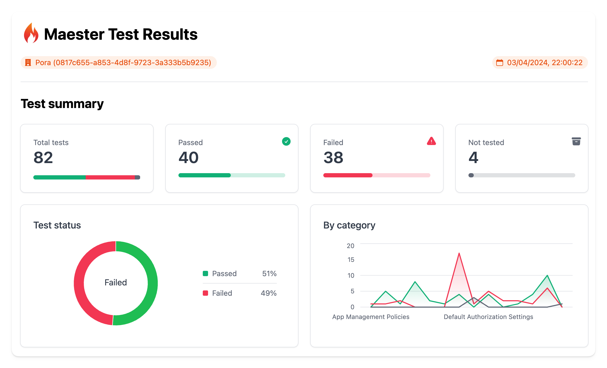
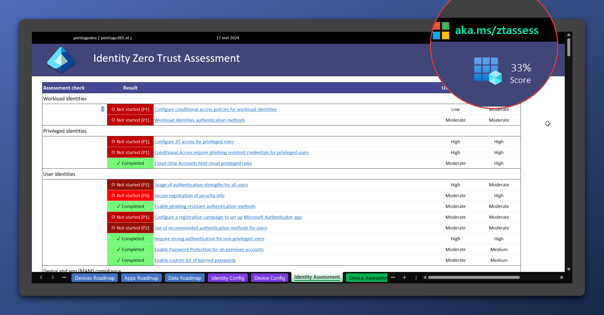
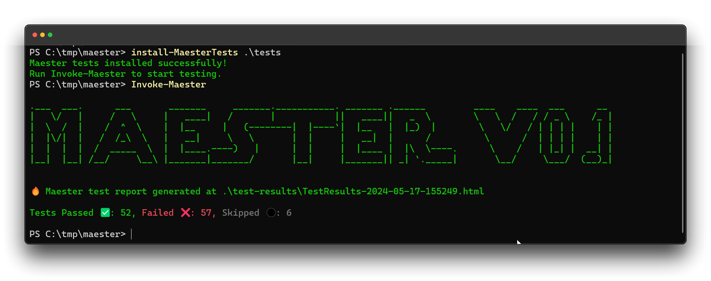
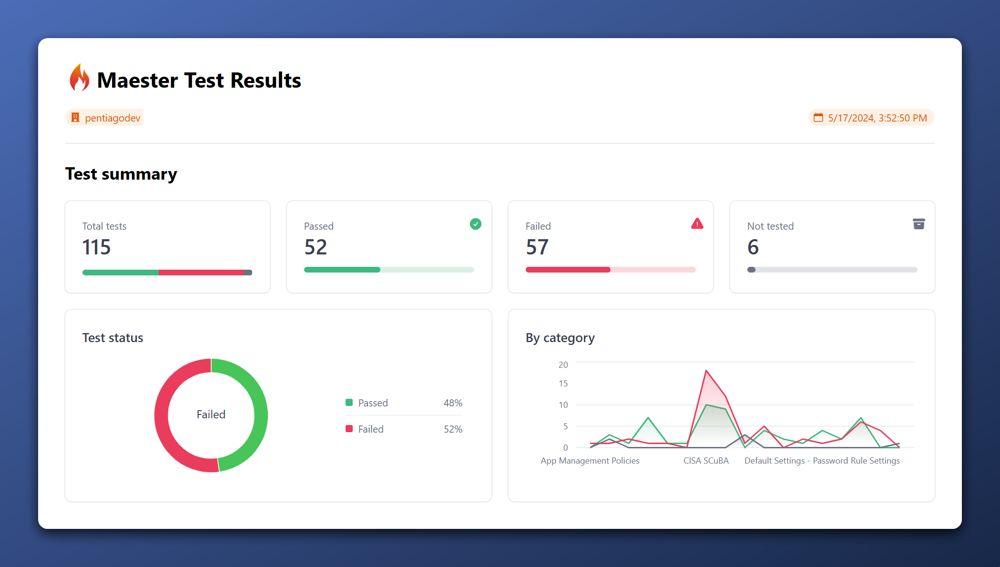

In Dutch, we have a saying: *'Bij de loodgieter lekt de kraan,'* which translates to 'The plumber has a leaking tap.' It means that someone may be good at their own job but doesn't pay attention to their own property. In this **blog series** I want to take you with me on a mission to achieve a top-notch Identity configuration for my own development tenant. For customers, I always strive for the best, but my own tenant is a mess. Believe me. **Follow me along as I'll use Open Source tools as guidance and improve security.**

> This blog series is about my path to a safer environment. All shown vulnerabilities have already been patched.
{: .prompt-warning}

## The tools we'll use

In the past months, two tools caught my eye while browsing the community:
- Zero Trust Assessment ([aka.ms/ztassess](https://aka.ms/ztassess))
- [Maester.dev](https://maester.dev)

The first one was initiated by the Microsoft Security Customer Acceleration Team (CAT). This is a community project maintained by Microsoft employees. However, it is not supported through any Microsoft Support Program or service. The second one is created by a few Microsoft Security MVPs and therefore also community based. While the Zero Trust Assessment is focused on crafting a roadmap to a Zero Trust implementation in your whole organization, Maester.dev tries to give you a dashboard with settings that have not been configured correctly based on a list of baselines like the [Entra ID Security Config Analyzer (EIDsca)](https://github.com/Cloud-Architekt/AzureAD-Attack-Defense/blob/main/AADSecurityConfigAnalyzer.md) and [Cisa Secure Cloud Business Applications Project](https://www.cisa.gov/resources-tools/services/secure-cloud-business-applications-scuba-project) of the America's Cyber Defense Agency. Coincidently, both are partly maintained by the incredible [Merill Fernando](https://www.linkedin.com/in/merill/).

Open Source tools are nice, however, how do they compare to the already built in [Microsoft Identity](https://learn.microsoft.com/en-us/entra/identity/monitoring-health/concept-identity-secure-score) [Secure Score](https://www.microsoft.com/en-us/security/business/microsoft-secure-score)? That's what we will find out in this series.

## About my tenant

I'm using an 'Office Developer' tenant which contains a set of demo users, data and 25 E5 licenses without Windows or Teams Calling. The tenant is used by myself and sometimes I add a customer or colleague with guest access for some specific resources that I'm developing at the time. I haven't done anything serious with Intune as I don't have any devices connected to my dev-tenant. This means that things like device compliancy will pop up and maybe Defender will be a thing. Those demo users are there, but I don't think that I've used them all, so MFA is not yet registered for all of those accounts.

What I expect to work on:
- Conditional Access
- Device compliancy
- Authentication methods
- Collaboration settings
- Almost everything...

_Example Maester report_

## The first step: Set the baseline

How do we know that I've actually achieved something? By getting the results for all assessments without changing anything yet. So, what do we have?

### Microsoft Identity Secure Score

The first we look at is the Microsoft Secure Score for Identity. When I started writing this series, I immediately stumbled upon a problem as there were multiple versions available with different scores. We have the Secure Score for Identity that is currently in preview and can be found in the [Entra Admin panel > Recommendations](https://entra.microsoft.com/#view/Microsoft_AAD_IAM/TenantOverview.ReactView/tabId/recommendationsTab) where I scored 65.18%. 

{: w="350" }
_Modern Secure Score for Identity result at the start_

However, there is also the Identity Secure Score blade within the [Protection or Security tab within Entra](https://entra.microsoft.com/#view/Microsoft_AAD_IAM/SecurityMenuBlade/~/IdentitySecureScore/menuId/IdentitySecureScore/fromNav/) where I scored 59.84%. 

{: w="350" }
_Lower secure score in classic view_

This had to do with a 'Start your Defender for Identity deployment' advise that has a week later disappeared. The scores are now the same in every pane.

{: w="500" }
_Not that bad after all_

### Zero Trust Assessment

The Zero Trust Assessment should guide me across the paths to a Zero Trust implementation. I haven't done anything specific regarding Zero Trust. Therefore, I was a bit worried about my score. 

_Zero Trust Assessment baseline_

A score of 33% means that I have some work to do. What's nice about this assessment, is that it shows the required licenses for each recommendation in the overview. We'll go into more detail in the specific blog post for this assessment.

### Maester.dev

Maester is the one that I look out to the most as it is versatile and 'modern'. It gives you a few different output formats like .md, .html and .json which can be implemented in pipelines for notifications. Also, it shows you a graph of the tested categories and their scores.  I passed 48% of the tests that where available at May 17th 2024. 
{: w="500" }
_Maester.dev Terminal results_

{: w="500" }
_Maester.dev Browser results_

## Conclusion

In this blog, you could read how I will improve security of my Microsoft Azure and Microsoft Entra developer tenant. We've seen the current scores for each assessment. In the next blog, I will try to bring up the Microsoft Secure Score for Identity as high as possible by implementing all possible recommendations.
