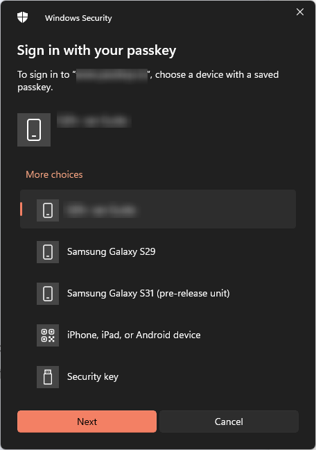
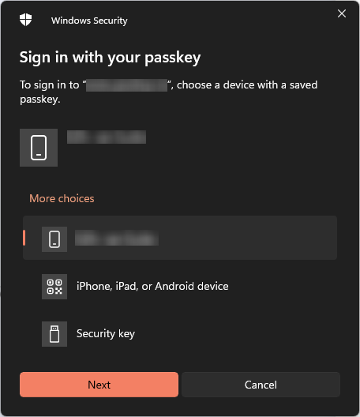

Have you ever wondered how to get rid of old devices in the Windows Security window when you try to sign in with a passkey? This blog shows you how! If you are like me, you try and test a lot of stuff. Just like when the latest generation of passkeys was released. I've tried to use multiple devices with multiple android versions to sign in with remote passkeys. This means that the window that's shown when you try to sign in with a passkey from Windows 11 was a bit overcrowded.  


_Multiple devices in the prompt. I only use one._

It frustrated me a little bit. So I went on searching until I found the fix. Devices that you have used in the past to store passkeys on are saved in the registry as a linked FIDO device. The following key brings you to the whole list where you can clean up unused devices:

```console
Computer\HKEY_USERS\S-1-5-20\Software\Microsoft\Cryptography\FIDO\(UserSID)\LinkedDevices
```

Each device has it's own key with a `Name` and a `Data` value. If you want to clean up the list of devices, first make an export of the `LinkedDevices` key, check which guid corresponds with the device you want to remove from the list and then remove the key.


_Single device in the prompt._

The next thing I want to find out is how to select `Security Key` as default so I won't have to click anymore.