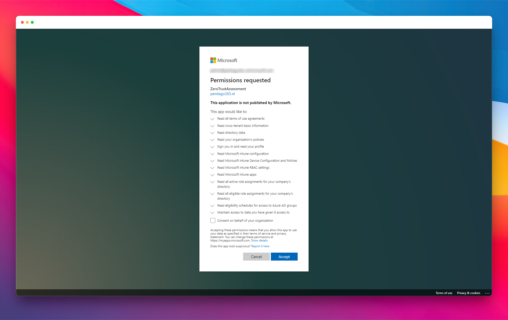
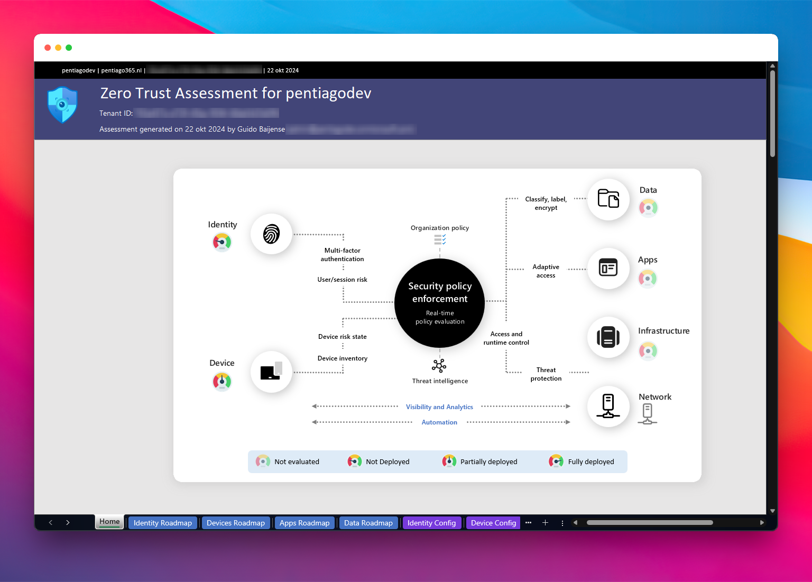
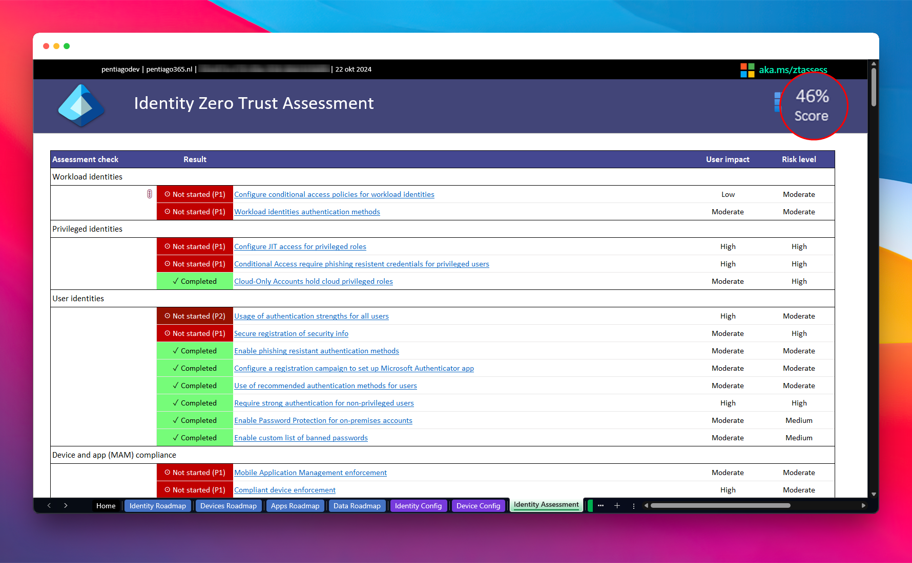
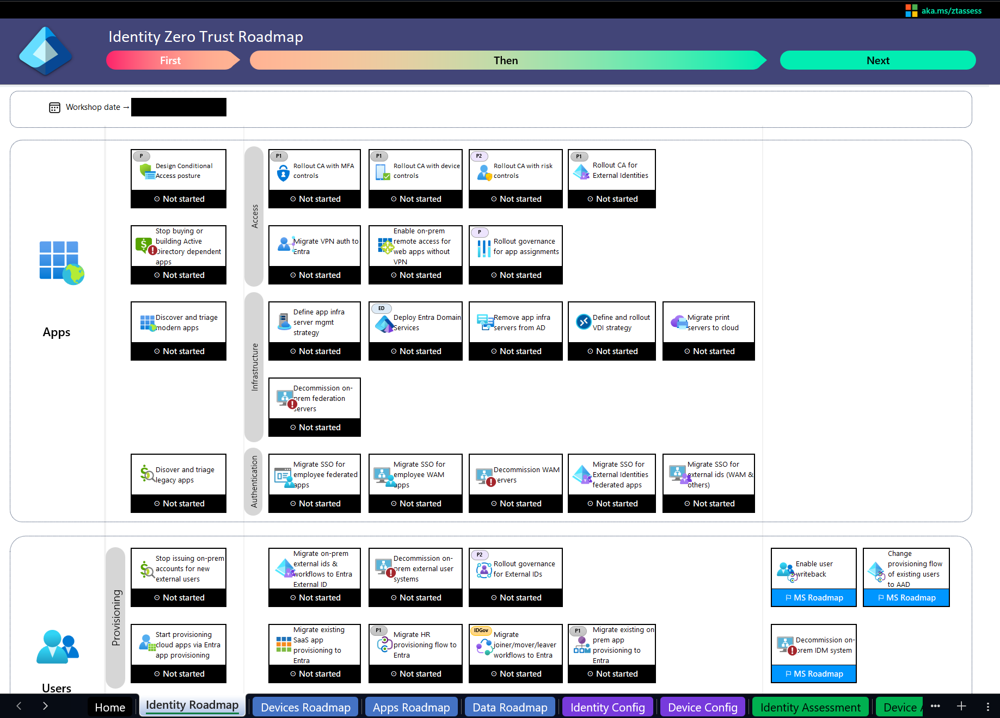

This blog will show you how you can leverage the Zero Trust Assessment to improve your security posture and how I have used this to strengthen the posture of my own environment. The Zero Trust Assessment is a tool that helps you to identify the current state of your environment and provides you with insights on how to improve your security posture. It is a great way to get started with Zero Trust and to identify areas where you can make improvements.

In the past blogs [past blogs](https://blog.pentiago365.nl/tags/fixingmyownenvironment) in this series, I have covered [Maester.dev](https://maester.dev/) and Microsoft Secure Score for Identity. These tools are great for identifying areas where you can improve your security posture, but they do not provide you with a roadmap on how to get there. Does this assessment really help you to get there? Let's find out!

>I know that I said before that I would continue with Maester.dev, but a colleague asked me about the ZTA tool and I wanted to know more about it as well. So I decided to write about this tool first. I will continue with Maester.dev in the next blog. Maybe.
{: .prompt-info}

## What is Zero Trust Assessment?

[The website](https://aka.ms/ztassess) describes the Zero Trust Assessment as follows: "A tool to check your Microsoft tenant configuration for zero trust readiness." It is built by the `Microsoft Security → Customer Acceleration Team (CAT)` and is available for free. It is presented as a three steps process:

1. **Run assessment**: The tool will assess the tenant config and downloads the roadmap templates that will be used during the (potential) workshops.
2. **Strategy workshops**: Schedule workshops with Microsoft consultants for each of the Identity, Devices, Data and Network pillars.
3. **Implement roadmap**: Review the results of the workshop and implement the zero trust roadmap across the entire digital estate for end to end security.

As you might guess, I am not a company. I also won't schedule a workshop with Microsoft consultants as I'm a Microsoft consultant myself. All I want to know is how this tool can help me to improve the (Identity) security posture of my own environment, but also how this tool can help my customers with theirs. So let's dive in!

## Running the assessment

It is not that difficult to run the assessment. Al you need to do is:

1. Open PowerShell 7
2. Run the following command:

    ```powershell
    Install-Module ZeroTrustAssessment
    Invoke-ZTAssessment
    ```

3. Follow the instructions for login and permissions.

It leverages the Microsoft Graph PowerShell Enterprise Application (`AppId: 14d82eec-204b-4c2f-b7e8-296a70dab67e`) in your environment to connect to Microsoft Graph and read the configuration of your tenant with delegated permissions, but it is also possible to use a specifically crafted application registration for this assessment. You should then use the `ClientId` and `TenantId` parameters when invoking the assessment. If you want, you can also invoke the assessment with an `AccessToken`.

The following scopes are used to connect with Microsoft Graph:

| Scope |
|-------|
|Agreement.Read.All|
|CrossTenantInformation.ReadBasic.All|
|Directory.Read.All|
|Policy.Read.All|
|User.Read|
|DeviceManagementServiceConfig.Read.All|
|DeviceManagementConfiguration.Read.All|
|DeviceManagementRBAC.Read.All|
|DeviceManagementConfiguration.Read.All|
|DeviceManagementApps.Read.All|
|RoleAssignmentSchedule.Read.Directory|
|RoleEligibilitySchedule.Read.Directory|
|PrivilegedEligibilitySchedule.Read.AzureADGroup|


_The consent request for Zero Trust Assessment_

What it basically does during runtime is:

- Query Graph for directory settings, Group settings, App Consents and App Registrations
- Query Intune policies regarding MDM, Device Enrollment, Compliancy, scope tags, etc.
- Query Graph for Authentication Methods, Role assignments, etc.

Afterwards, it will compare this information with some predefined settings and will give you a score for each of the pillars.

## The results

The results are presented in a Excel document that can also be used for road-mapping. It contains data for the Identity, Devices, Data and Network pillars. As I am a Identity Consultant, I will only look at the Identity pillar. Also, I don't have networks, Data or devices in my tenant.

And wow. The result's say it's bad. It only has scores for Devices and Identity. Devices scores 'Partially deployed' and Identity scores 'Not deployed'. This is not good. I have to fix this!


_The Zero Trust Assessment says it's bad_

When looking into the real scores, it's not that bad at all: a `46%` score for Identity and a `70%` score for devices. I have a single device in my tenant: a devBox. And the policies I use have been stolen from my employers template tenant like 2,5 years ago.


_Specific Identity Results in Zero Trust Assessment report_

If we look into the Identity results in detail, we see that the following settings are not deployed:

- **Workload identities**: I don't have any workload identities licenses in my tenant. Also, I don't have any privileged workload identities anymore, since I've removed them when writing the [Microsoft Secure Score for Identity]() blog.

- **Privileged identities**: Two items that I have failed:
  - Configure JIT access for privileged roles.
  - Conditional Access require phishing resistent credentials for privileged users.

I am not totally convinced that I failed miserably on these items. I have configured JIT for privileged roles. But I don't enforce it as I am the only user and I am working phishing resistant and password less. As long as I don't have the password myself, I think I am safe. 
This means that the second one is something I should address: The explanation shows that I have not deployed a CA policy for Global Administrators to require phishing-resistant credentials. I should do this. I will do this. I did. 

My CA policy for admins required MFA for admin roles and had the Break Glass user still excluded, but since all users need to do MFA for portal access this can be changed. I now changed the policy to include the Break Glass user as well and require phishing resistant MFA instead of just MFA. Phishing resistant was already implemented and in use, but not enforced.

- **User identities**: Again two failed items:
  - Usage of authentication strengths for all users.
  - Secure registration of security info.

Possible the same issue as with the phishing resistent credentials for privileged users. I have excluded the Break Glass user from CA policies. Let's change that one as well.

In the explanation, it mentions that I have synced accounts with the Global Admin role. That's strange as I don't have any synced accounts in my tenant. After a re-run of the assessment, this item still is not fixed, so it seems like it parses some data incorrectly. I will ignore this one.

The secure registration of security info is turned off by choice. It is my test tenant. I don't have an office network. I don't have managed devices. All I have are a few Fido-keys and test users. I don't want to sign in with admin user A to create a TAP for test user B to be able to sign in with test user B when I quickly want to test something.

- **Device and app (MAM) compliance**: I don't have any devices in my tenant and always use unmanaged or devices that are managed by my employer. So this is not applicable in my case.

## Conclusion

After a rerun of the assessment, the results are a bit better. The Identity gets a 'Partially deployed' score of `53%`. I don't think that this assessment functionality of the tool really helps you with your security posture. Maester.dev and Microsoft Secure Score for Identity are better tools for that. The strength of the Zero Trust Assessment is the roadmap that is generated.


_The Zero Trust Assessment Roadmap feature_

For each pillar, it comes with an overview of what items you can address and it links to Microsoft Learn pages with information on how you can address them. This is a great way to get started with Zero Trust and to identify areas where you can make improvements. It is a great tool for companies that want to get started with Zero Trust and need a roadmap to get there. And as an IAM consultant, I can use this tool to help my customers with their Zero Trust journey and will recommend it to everyone that wants to start or evaluate their journey.